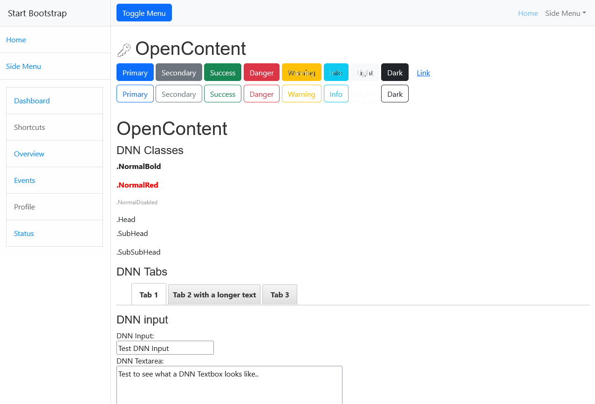

# DNNCMS Simple Side Menu Starter Theme
## Bootstrap 5 
https://startbootstrap.com/template/simple-sidebar

## About
This is the first *Beta Version* of a DNN Theme version based on the Bootstrap Simple Sidebar Starter Theme.
Please note that this DNN Theme will stay as near to the Bootstrap 5 Template as Possible, so with the Template's limitations

## Notes:

- The Theme uses Gulp to parse the SCSS.
- Containers come from _src/Containers folder and are on change copied to the appropriate DNN container folder. (due to Git limitations)
- The Gulp script assumes the name of your container folder is the same as the skin folder.
- I'll  add more documentation on setting up the development environment to create a modified version of this theme.

